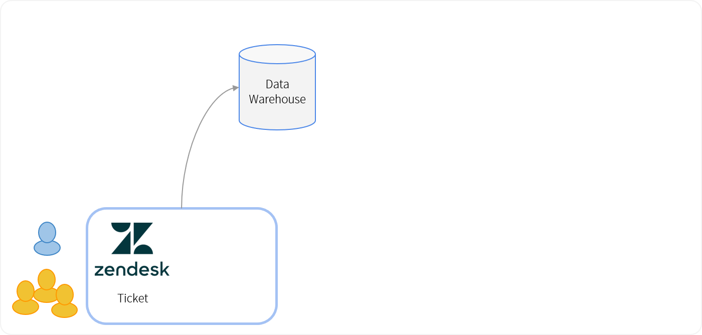
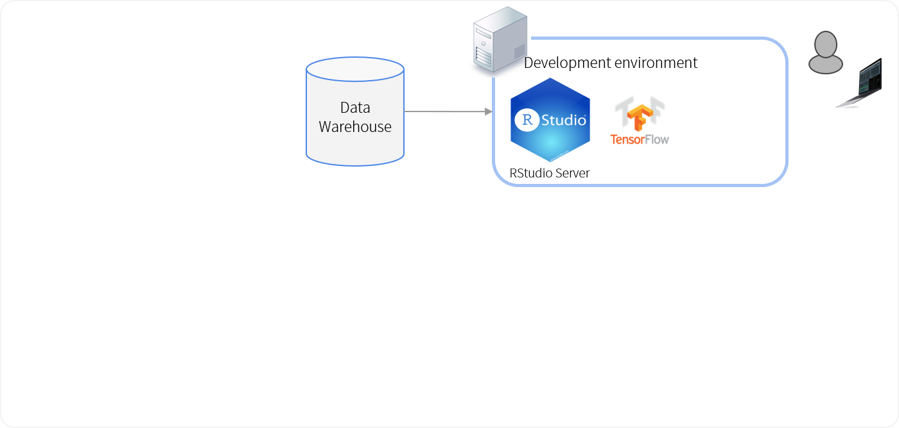
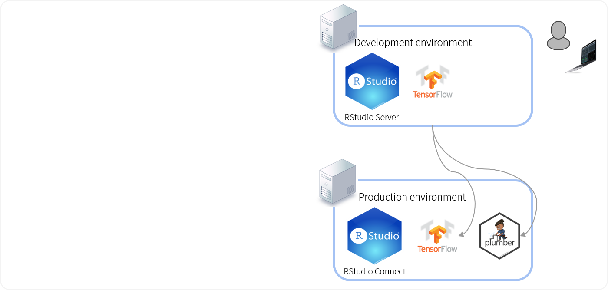
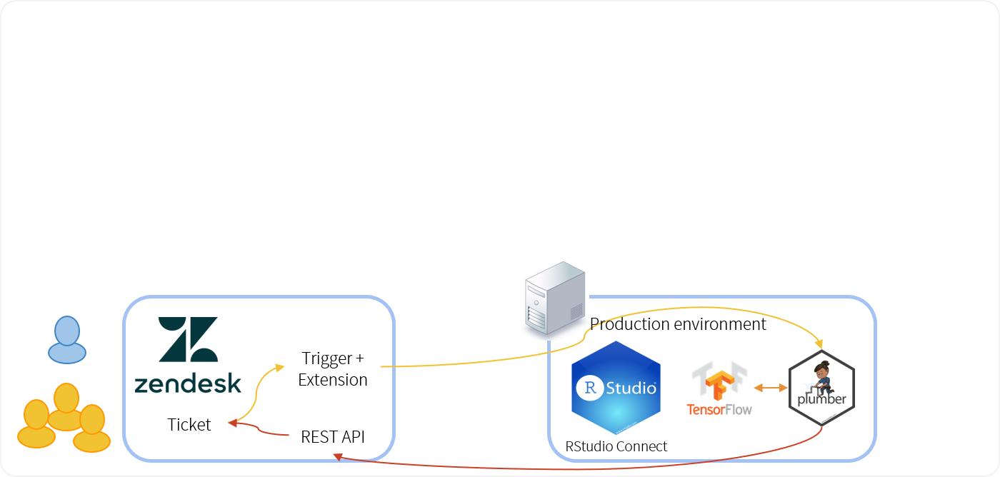
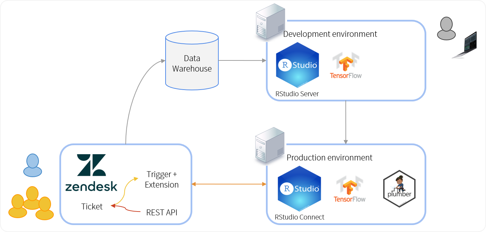

```{r setup, include=FALSE}
options(htmltools.dir.version = FALSE)
```

class: rstudio-slide

# Abstract

.smaller[
TensorFlow is the most popular deep learning framework, and R users can use the full power of TensorFlow using the `keras` package.  Many resources exist that describe how to train a model and achieve good results.

However, **production deployment introduces many complications**. For example, the architect must design an appropriate architecture (CPU, GPU or TPU) for training as well as scoring.

Production deployment assumes that you can readily **create a pipeline** that includes data pre-processing, model evaluation and re-training, as well as scoring on a production server with a suitable API.

The R packages `tfdatasets`, `tfruns`, `cloudml` and `tfdeploy` provides a solution for **building pipelines, evaluating models, training hyperparameters** at scale and deploying TensorFlow models to a production server.

The `keras` package allows exporting a model to native format that is easy to deploy, but pre-processing on the TensorFlow graph is much faster than pre-processing using R - this is enabled by the `tfdatasets` package.

I illustrate the concepts by an RStudio internal deep network that classifies support tickets using **natural language processing** with recurrent layers. The network is deployed on an instance of RStudio Connect, and informs recommendations on Zendesk ticketing system.
]

---
class: rstudio-slide

# Outline

.larger[
* TensorFlow
* Challenges of production deployment
* Problem description: Zendesk tickets
* Machine learning pipeline
* Deployment with RStudio Connect
* Case study
]

.rightbottom[

]]


---

class: rstudio-fill-slide, left, middle

# TensorFlow

---
class: rstudio-slide

## TensorFlow


---
class: rstudio-slide

## TensorFlow APIs


---

class: rstudio-fill-slide, left, middle

# Challenges of production deployment

---
class: rstudio-slide

## Why production fails

* Failing to quantify the busines value

* Inability to get stakeholder buy-in

* Getting stuck in optimising model fit

* Failing to close the end-to-end loop

* Lack of change management


---
class: rstudio-fill-slide, left, middle

# Problem description: Zendesk tickets

---
class: rstudio-slide

## What is a zendesk ticket?


---
class: rstudio-slide

## What is a zendesk ticket?


---
class: rstudio-slide

## The business problem

Goal:

* Predict which support tickets will be "complex"
* Complexity is the number of back-and-forth comments in the ticket
* High complexity can also be a leading indicator of troubled accounts

Business value:

* Intervene early in complex tickets
* For example by scheduling a phone call with the customer

---
class: rstudio-slide

## Getting stakeholder buy-in

Stakeholder buy-in is critical to the success of your project.

The data science team must work **with** the stakeholders:

* Users
* Management
* IT teams


---
class: rstudio-fill-slide, left, middle

# Machine learning pipeline

---
class: rstudio-slide

## Data warehouse



---
class: rstudio-slide

## Development environment



---
class: rstudio-slide

## Modeling


---
class: rstudio-slide

## Don't get stuck in optimising model fit


---

class: rstudio-fill-slide, left, middle

# Deployment with RStudio Connect

---
class: rstudio-slide

## Production environment



---
class: rstudio-slide,  center, middle

## RStudio Connect 


---
class: rstudio-slide

## Deploying a TensorFlow model

---
class: rstudio-slide

## plumber APIs

The `plumber` package converts your script into an API using simple decorators in the comments

```r
#* @apiTitle TensorFlow zendesk ticket scoring API

#* Predicts ticket complexity given the initial issue.
#*
#* @param org Ticket organization name
#* @param description Ticket description (text)
#* @param title Ticket title
#* @param id Ticket id
#* 
#* @post /
function(id, title, description, org) {
  score <- runif(1) # <<
  record_in_googlesheet(id, title, description, org, score)
  score
}
```

---
class: rstudio-slide

## Hosting plumber APIs on Connect


---
class: rstudio-slide

## Closing the end-to-end loop




---
class: rstudio-slide

## Updating the ticket information


---
class: rstudio-slide

## Creating an API log file


---

class: rstudio-fill-slide, left, middle

# Case study

---
class: rstudio-slide

## Overall architecture




---
class: rstudio-slide,  center, middle

# Thank you! 

  


Slides:

<http://colorado.rstudio.com/rsc/TensorFlow-Production-EARL-2018/>


Subscribe to the blog to stay up to date!

<https://tensorflow.rstudio.com/blog/>
