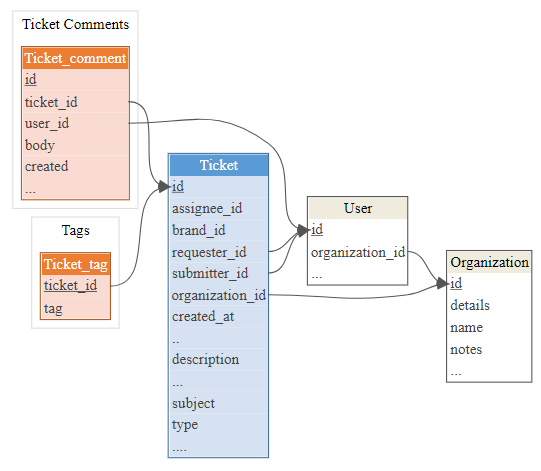
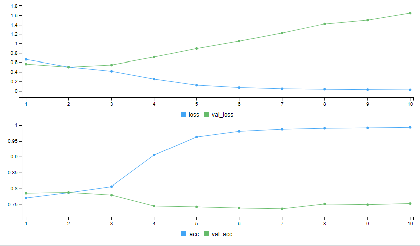

class: title-slide

```{r setup, include=FALSE}
options(htmltools.dir.version = FALSE)
```


class: title-slide   

# Taking TensorFlow into Production

## (A case study of Zendesk tickets)  

### Andrie de Vries<br/>Solutions engineer, RStudio

#### 2018/09/12 <br> (updated: `r Sys.Date()`)

.rightbottom[

]

---
class: rstudio-slide

# Outline

* Challenges of production deployment

* Model development

* Deployment with RStudio Connect

* Closing the end-to-end loop


.rightbottom[

]


---

class: rstudio-fill-slide, center, middle

# TensorFlow

---
class: white-slide

## TensorFlow


---
class: white-slide

## TensorFlow APIs


---

class: rstudio-fill-slide, center, middle

# Challenges of production deployment

---
class: rstudio-slide

## When production deployment fails

* Failing to quantify the busines value

* Inability to get stakeholder buy-in

* Getting stuck in optimising model fit

* Failing to close the end-to-end loop

* Lack of change management


---
class: rstudio-fill-slide, center, middle

# Problem description: Zendesk tickets

---

class: white-slide

## A typical support ticket


.right-column[
.client-speech[ My code doesn't work, help me ]

.agent-speech[ Sure, what's the problem ]

.client-speech[ I'm stuck... ]

.agent-speech[ . . . ]

.client-speech[ . . . ]
]

--

.left-column[

Initial message

* Subject
* Text
* Company name
* Person
* Date

Subsequently

* tags 
* additional comments


]

---
class: white-slide

## What is a zendesk ticket?


---
class: white-slide

## The business problem

* Predict which support tickets will be **complex**

* Complexity is the total **number of comments** in the ticket

* This indicates

  - **Multiple interventions** by support 
  
  - Potentially a leading indicator of **troubled accounts**

---
class: white-slide

## The business value

* **Intervene early** in complex tickets, e.g. by scheduling a phone call with the customer

* Reduce **number** of complex tickets

* Reduce **churn**


---
class: rstudio-fill-slide, center, middle

# Before you start...


---
class: rstudio-slide

## Get stakeholder buy-in

Stakeholder buy-in is critical to the success of your project.

Work **with** your stakeholders:

* Users

* IT teams

* Management

* Finance


---
class: rstudio-fill-slide, center, middle

# Machine learning pipeline

---
class: white-slide

## Architecture


---
class: white-slide

## Data warehouse


---
class: white-slide

## Zendesk database schema


---
class: white-slide

## Zendesk database schema extract

```{r, eval = FALSE}
library(datamodelr)
dm_read_yaml("1_zendesk_schema.yml") %>% 
  dm_create_graph(rankdir = "LR", columnArrows = TRUE) %>% 
  dm_render_graph()
```

```yaml
# data model segments

- segment: &tc Ticket Comments
- segment: &tg Tags

# Tables and columns

- table: Ticket
  segment:
  display: accent1
  columns:
    id: {key: yes}
    assignee_id:
    brand_id:
    requester_id: {ref: User}
    submitter_id: {ref: User}
    organization_id: {ref: Organization}
    created_at:
    ..:
    description:
    ...:
    subject:
    type:
    ....:

- table: Ticket_comment
  segment: *tc
  display: accent2
  columns:
    id: {key: yes}
    ticket_id: {ref: Ticket}
    user_id: {ref: User}
    body:
    created:
    ...:

- table: Ticket_tag
  segment: *tg
  display: accent2
  columns:
    ticket_id: {key: yes, ref: Ticket}
    tag:

- table: Organization
  segment:
  columns:
    id: {key: yes}
    details:
    name:
    notes:
    ...:

- table: User
  segment:
  columns:
    id: {key: yes}
    organization_id: {ref: Organization}
    ...:
```


---
class: white-slide

## Zendesk database schema extract




---
class: white-slide

## Development environment


---
class: white-slide

## Modeling

Keras sequential model

```{r, eval=FALSE}
model <- keras_model_sequential() %>% #<<
  layer_embedding(
    input_dim = MAX_NUM_WORDS, 
    output_dim = EMBEDDING_DIM, 
    input_length = MAX_SEQUENCE_LENGTH
  ) %>% 
  layer_global_average_pooling_1d() %>% 
  layer_dense(units = 32, activation = 'relu') %>% 
  layer_dense(units = 16, activation = 'relu') %>% 
  layer_dropout(0.25) %>% 
  layer_dense(1, activation = 'sigmoid')

```

---
class: white-slide

## Modeling

With embedding layer to learn the text features

```{r, eval=FALSE}
model <- keras_model_sequential() %>% 
  layer_embedding(                      #<<
    input_dim = MAX_NUM_WORDS,          #<<
    output_dim = EMBEDDING_DIM,         #<<
    input_length = MAX_SEQUENCE_LENGTH  #<<
  ) %>%                                 #<<
  layer_global_average_pooling_1d() %>% 
  layer_dense(units = 32, activation = 'relu') %>% 
  layer_dense(units = 16, activation = 'relu') %>% 
  layer_dropout(0.25) %>% 
  layer_dense(1, activation = 'sigmoid')

```


---
class: white-slide

## Modeling

Simple multi layer perceptron

```{r, eval=FALSE}
model <- keras_model_sequential() %>% 
  layer_embedding(
    input_dim = MAX_NUM_WORDS, 
    output_dim = EMBEDDING_DIM, 
    input_length = MAX_SEQUENCE_LENGTH
  ) %>% 
  layer_global_average_pooling_1d() %>% 
  layer_dense(units = 32, activation = 'relu') %>% #<<
  layer_dense(units = 16, activation = 'relu') %>% #<<
  layer_dropout(0.25) %>% 
  layer_dense(1, activation = 'sigmoid')

```

---
class: white-slide

## Modeling

One-dimensional convolution

```{r, eval=FALSE}
model <- keras_model_sequential() %>% 
  layer_embedding(
    input_dim = MAX_NUM_WORDS, 
    output_dim = EMBEDDING_DIM, 
    input_length = MAX_SEQUENCE_LENGTH
  ) %>% 
  layer_conv_1d(filters = 512, kernel_size = 3, activation = 'relu') %>% #<<
  layer_max_pooling_1d(pool_size = 3) %>%
  layer_dropout(0.1) %>%
  layer_conv_1d(filters = 256, kernel_size = 3, activation = 'relu') %>%
  layer_max_pooling_1d(pool_size = 3) %>%
  layer_dropout(0.1) %>%
  layer_dense(1, activation = 'sigmoid')
```


---
class: white-slide

## Modeling

One-dimensional **separable** convolution


```{r, eval=FALSE}
model <- keras_model_sequential() %>% 
  layer_embedding(
    input_dim = MAX_NUM_WORDS, 
    output_dim = EMBEDDING_DIM, 
    input_length = MAX_SEQUENCE_LENGTH
  ) %>% 
  {{layer_separable_conv_1d(
    filters = 64, 
    kernel_size = 3, 
    depth_multiplier = 2
  )}} %>% 
  layer_flatten() %>% 
  layer_dense(units = 32, activation = 'relu') %>% 
  layer_dense(units = 16, activation = 'relu') %>% 
  layer_dropout(0.25) %>% 
  layer_dense(1, activation = 'sigmoid')

```

---
class: white-slide

## That didn't work well...


---
class: white-slide

## Modeling using the functional API

More complex model using `keras` [functional API](https://keras.rstudio.com/articles/functional_api.html)

> The Keras functional API is the way to go for defining complex models, such as multi-output models, directed acyclic graphs, or models with shared layers.

---
class: white-slide

## Modeling using the functional API

More complex model using `keras` [functional API](https://keras.rstudio.com/articles/functional_api.html)


```{r, eval=FALSE}
concatenated <- layer_concatenate(
  list(name_embedding, subject_embedding, text_embedding)
)

output <- concatenated %>%
  layer_dense(units = dense_dim) %>%
  layer_activation_leaky_relu() %>%
  layer_dropout(0.5) %>%
  layer_dense(units = 1, activation = "sigmoid")

{{model <- keras_model( 
  inputs = list(name_input, subject_input, text_input), 
  outputs = output
)}}

```

---

class: white-slide

## Modeling using the functional API

More complex model using `keras` [functional API](https://keras.rstudio.com/articles/functional_api.html)

```{r, eval=FALSE}
concatenated <- layer_concatenate(
  list(name_embedding, subject_embedding, text_embedding) #<<
)

output <- concatenated %>%
  layer_dense(units = dense_dim) %>%
  layer_activation_leaky_relu() %>%
  layer_dropout(0.5) %>%
  layer_dense(units = 1, activation = "sigmoid")

model <- keras_model(
  inputs = list(name_input, subject_input, text_input), #<<
  outputs = output
)

```


---

class: white-slide


## That didn't work well either



---
class: white-slide

## That didn't work well either


---
class: highlight-slide, center, middle

# Don't get stuck on model tuning!!!

---

class: rstudio-fill-slide, center, middle

# Deployment with RStudio Connect

---
class: white-slide

## RStudio Connect 


---
class: white-slide

## Deployment architecture


---
class: white-slide

## Deploying a TensorFlow model

First deployment

```r

rsconnect::deployTFModel(
  last_model,
  appTitle = glue("TensorFlow classifier {model_name}")
)
```

Subsequent deployments

```r

rsconnect::deployTFModel(
  last_model, 
  appId = "....",
  forceUpdate = TRUE
)
```

---
class: white-slide

## Viewing the TensorFlow model API

In RStudio Connect


---
class: white-slide

## Calling the TensorFlow serving API

```{r, eval=FALSE}
# Construct the payload
body <- list(
  instances = list(list(
    x_val[1, ]
  )))
```

```{r, eval=FALSE}
# Call the API
api_url <- glue("http://{host}/content/{app_id}/predict")

score <- api_url %>% 
  POST(body = body, encode = "json") %>% 
  content() %>% 
  fromJSON() %>% 
  .$predictions %>% 
  .[, , 1]
```

```{r, eval=FALSE}
score
## [1] 0.486874
```


---
class: white-slide

## plumber APIs

The `plumber` package **converts your script** into an API using simple **comment decorators**

```r
#' @apiTitle TensorFlow zendesk ticket scoring API

#' Predicts ticket complexity given the initial issue.
#'
#' @param org Ticket organization name
#' @param description Ticket description (text)
#' @param title Ticket title
#' @param id Ticket id
#' 
#' @post /
function(id, title, description, org) {
  score <- runif(1) # <<
  record_in_googlesheet(id, title, description, org, score)
  score
}
```

---
class: white-slide

## Hosting plumber APIs on Connect


---

class: rstudio-fill-slide, center, middle

# Closing the end-to-end loop

---
class: rstudio-slide

## Closing the end-to-end loop

* New ticket arrives

* Zendesk triggers a call to `plumber` API

* API

  - pre-processes the text, calls TensorFlow API
  - Retrieves score
  - Write record to log file
  - Calls Zendesk API
  
* Zendesk

  - Inserts comment into ticket
  - Updates ticket tag

---
class: white-slide

## Updating the ticket information


---
class: white-slide

## Closing the end-to-end loop


---
class: white-slide

## Creating an API log file


---

class: rstudio-fill-slide, center, middle

# Summary


---
class: rstudio-slide

## Lessons learnt: modeling

TensorFlow doesn't do all your feature engineering.

You must decide **which features** to use as inputs to the model:

* Possibly from **multiple sources**

* At the cost of greater **model complexity**

---
class: rstudio-slide

## Lessons learnt: deployment

It is still harder than it should be to deploy models.

Feature requests:

* TensorFlow click-button deployment

* Better API swagger documentation

* Sample scripts to generate JSON body

---
class: rstudio-slide

## What next?

Ideas to improve model

* Different embeddings, e.g. `word2vec`

* Hyperparameter tuning

* Include additional comment text in model

* ...

---
class: rstudio-slide

## What next?
New ideas for business value

* Predict **tags** based on text

* **Recommend** best support articles

* **Automate** license key requests

* ...

---
class: white-slide

## Overall architecture


---
class: rstudio-slide,  center, middle

# Thank you! 

  


.smaller[
Slides:

<http://colorado.rstudio.com/rsc/TensorFlow-EARL-2018/>


Subscribe to the blog to stay up to date!


<https://tensorflow.rstudio.com/blog/>
]
