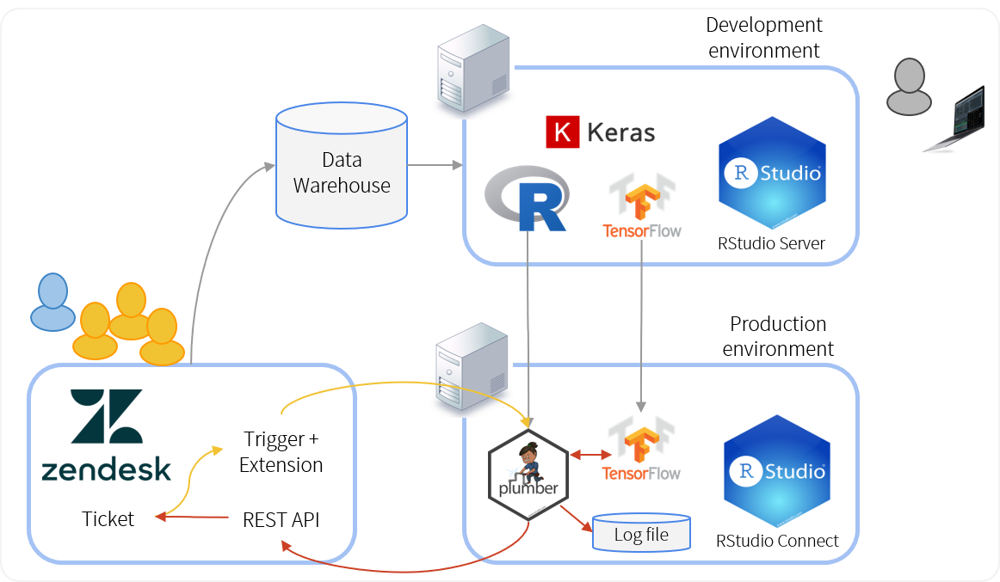

class: rstudio-slide

```{r setup, include=FALSE}
options(htmltools.dir.version = FALSE)
```


---
class: rstudio-slide

# Outline

* Challenges of production deployment

* Model development

* Deployment with RStudio Connect

* Closing the end-to-end loop


.rightbottom[

]


---

class: rstudio-fill-slide, left, middle

# TensorFlow

---
class: rstudio-slide

## TensorFlow


---
class: rstudio-slide

## TensorFlow APIs


---

class: rstudio-fill-slide, left, middle

# Challenges of production deployment

---
class: rstudio-slide

## When production deployment fails

* Failing to quantify the busines value

* Inability to get stakeholder buy-in

* Getting stuck in optimising model fit

* Failing to close the end-to-end loop

* Lack of change management


---
class: rstudio-fill-slide, left, middle

# Problem description: Zendesk tickets

---

class: rstudio-slide

## A typical support ticket


.right-column[
.client-speech[ My code doesn't work, help me ]

.agent-speech[ Sure, what's the problem ]

.client-speech[ I'm stuck... ]

.agent-speech[ . . . ]

.client-speech[ . . . ]
]

--

.left-column[

Initial message

* Subject
* Text
* Company name
* Person
* Date

Subsequently

* tags 
* additional comments


]

---
class: rstudio-slide

## What is a zendesk ticket?


---
class: rstudio-slide

## The business problem

Goal:

* Predict which support tickets will be "complex"
* Complexity is the number of back-and-forth comments in the ticket
* High complexity can also be a leading indicator of troubled accounts

Business value:

* Intervene early in complex tickets
* For example by scheduling a phone call with the customer

---
class: rstudio-slide

## Architecture


---
class: rstudio-slide

## Getting stakeholder buy-in

Stakeholder buy-in is critical to the success of your project.

The data science team must work **with** the stakeholders:

* Users
* Management
* IT teams


---
class: rstudio-fill-slide, left, middle

# Machine learning pipeline

---
class: rstudio-slide

## Data warehouse


---
class: rstudio-slide

## Development environment


---
class: rstudio-slide

## Modeling


---
class: rstudio-slide

## Don't get stuck in model building


---

class: rstudio-fill-slide, left, middle

# Deployment with RStudio Connect

---
class: rstudio-slide

## RStudio Connect 


---
class: rstudio-slide

## Deployment architecture


---
class: rstudio-slide

## Deploying a TensorFlow model

First deployment

```r

rsconnect::deployTFModel(
  last_model,
  appTitle = glue("TensorFlow classifier {model_name}")
)
```

Subsequent deployments

```r

rsconnect::deployTFModel(
  last_model, 
  appId = "....",
  forceUpdate = TRUE
)
```

---
class: rstudio-slide

## Viewing the TensorFlow model API

In RStudio Connect


---
class: rstudio-slide

## Calling the TensorFlow serving API

```{r, eval=FALSE}
# Construct the payload
body <- list(
  instances = list(list(
    x_val[1, ]
  )))
```

```{r, eval=FALSE}
# Call the API
api_url <- glue("http://{host}/content/{app_id}/predict")

score <- api_url %>% 
  POST(body = body, encode = "json") %>% 
  content() %>% 
  fromJSON() %>% 
  .$predictions %>% 
  .[, , 1]
```

```{r, eval=FALSE}
score
## [1] 0.486874
```


---
class: rstudio-slide

## plumber APIs

The `plumber` package converts your script into an API using comment decorators

```r
#* @apiTitle TensorFlow zendesk ticket scoring API

#* Predicts ticket complexity given the initial issue.
#*
#* @param org Ticket organization name
#* @param description Ticket description (text)
#* @param title Ticket title
#* @param id Ticket id
#* 
#* @post /
function(id, title, description, org) {
  score <- runif(1) # <<
  record_in_googlesheet(id, title, description, org, score)
  score
}
```

---
class: rstudio-slide

## Hosting plumber APIs on Connect


---

class: rstudio-fill-slide, left, middle

# Closing the end-to-end loop

---
class: rstudio-slide

## Closing the end-to-end loop

* New ticket arrives
* Zendesk triggers a call to `plumber` API
* API
  - pre-processes the text, calls TensorFlow API
  - Retrieves score
  - Write record to log file
  - Calls Zendesk API
* Zendesk
  - Inserts comment into ticket
  - Updates ticket tag

---
class: rstudio-slide

## Updating the ticket information


---
class: rstudio-slide

## Closing the end-to-end loop


---
class: rstudio-slide

## Creating an API log file


---

class: rstudio-fill-slide, left, middle

# Summary


---
class: rstudio-slide

## Lessons learnt

It is possible, but harder than it should be.

Feature requests:

* TensorFlow click-button deployment
* Better API swagger documentation
* Sample scripts to generate JSON body

Too early to tell longer term business impact

---
class: rstudio-slide

## What next?

Ideas to improve model

* Different embeddings, e.g. `word2vec`
* Hyperparameter tuning
* Include additional comment text in model

New ideas for business value

* Predict tags based on text
* Predict best support articles
* Automate license key requests


---
class: rstudio-slide

## Overall architecture




---
class: rstudio-slide,  center, middle

# Thank you! 

  


.smaller[
Slides:

<http://colorado.rstudio.com/rsc/TensorFlow-EARL-2018/>


Subscribe to the blog to stay up to date!


<https://tensorflow.rstudio.com/blog/>
]
